Los Angeles Crime 2010-2018
================
Brian Pang

``` r
library(ggmap)
library(lubridate)
library(dplyr)
library(magrittr)
library(stringr)
library(scales)
library(tidyr)
library(lubridate)
library(astsa)
library(forecast)
library(knitr)
library(kableExtra)
```

Part 1: Reading in Data, Cleaning and Creating Variables
========================================================

``` r
LACrime <- read.csv("~/Desktop/Datasets/LACrime.csv",header=T, na.strings=c("","NA"))

#NA per column
for(i in 1:ncol(LACrime)){
cat(c(names(LACrime)[i],sum(is.na(LACrime[,i])),"\n"))
}
```

    ## DR.Number 0 
    ## Date.Reported 0 
    ## Date.Occurred 0 
    ## Time.Occurred 0 
    ## Area.ID 0 
    ## Area.Name 0 
    ## Reporting.District 0 
    ## Crime.Code 0 
    ## Crime.Code.Description 388 
    ## MO.Codes 188680 
    ## Victim.Age 139571 
    ## Victim.Sex 160560 
    ## Victim.Descent 160600 
    ## Premise.Code 85 
    ## Premise.Description 3252 
    ## Weapon.Used.Code 1163418 
    ## Weapon.Description 1163419 
    ## Status.Code 2 
    ## Status.Description 0 
    ## Crime.Code.1 6 
    ## Crime.Code.2 1630385 
    ## Crime.Code.3 1738732 
    ## Crime.Code.4 1741193 
    ## Address 0 
    ## Cross.Street 1451844 
    ## Location 9

``` r
#1 New variables: Latitude and Longitude
x2 <- gsub(pattern = '[()]', replacement = "", x= LACrime$Location)
y2 <- str_split(x2, ',', n = 2, simplify= T)
z2 <-cbind(LACrime,y2)
z2$`2`[z2$`2`== ""] <- NA
names(z2)[27:28] <- c("Latitude", "Longitude")
z2$Latitude[z2$Latitude==0] <- NA
z2$Longitude <- as.numeric(as.character(z2$Longitude))
z2$Longitude[(z2$Longitude) == 0] <- NA
z2$Latitude <- as.numeric(as.character(z2$Latitude))

# New variables: Hour and HourMinSec
x <- str_pad(as.character(LACrime$Time.Occurred),4,"0",side="left")
y <-as.POSIXct(x, tryFormats= "%H%M")
z <- format(y, "%H:%M:%S")
z3 <- cbind(z2, z)
names(z3)[29] <- "HourMinSec"
z4 <- z3
z4$Hour <- hour(hms(z4$HourMinSec))

# New variables: WeekdayOccurred and WeekdayReported
z4$WeekdayOcc <-  as.factor(weekdays(mdy(z4$Date.Occurred)))
z4$WeekdayOcc <- factor(z4$WeekdayOcc, levels= c("Monday", 'Tuesday', 'Wednesday', 'Thursday', 'Friday', 'Saturday', 'Sunday'))
z4$WeekdayRep <-  as.factor(weekdays(mdy(z4$Date.Reported)))
z4$WeekdayRep <- factor(z4$WeekdayRep, levels= c("Monday", 'Tuesday', 'Wednesday', 'Thursday', 'Friday', 'Saturday', 'Sunday'))

# New Variable - DaysUnreported
z4$Date.Reported <- as.Date(mdy(z4$Date.Reported))
z4$Date.Occurred <- as.Date(mdy(z4$Date.Occurred))
z4$DaysUnreported <- as.numeric(z4$Date.Reported - z4$Date.Occurred)

# New variable SimplifiedDescent
z4$SimplifiedDescent <- z4$Victim.Descent
z4$SimplifiedDescent[which(z4$Victim.Descent %in% c("C","D","F","J","K","L","V","Z"))] <- "A"
z4$SimplifiedDescent[which(z4$Victim.Descent %in% c("S","U","G"))] <- "P"
z4$SimplifiedDescent[which(z4$Victim.Descent %in% c("-","X", "O"))] <- NA
z4$SimplifiedDescent[which(z4$SimplifiedDescent == "P")] <- "A"
z4$SimplifiedDescent[which(z4$SimplifiedDescent == "I")] <- "W"
z4$SimplifiedDescent <- as.factor(as.character(z4$SimplifiedDescent))

# New Variable, SimplifiedAddress
string1 <- "\\d+\\s"
SimplifiedAddress1 <- as.character(z4$Address)
z4$SimplifiedAddress <- as.factor(str_replace_all(SimplifiedAddress1, string1, ""))

# Modify Victim.Sex variable to binary values
z4$Victim.Sex[which(z4$Victim.Sex %in% c("X", "H", "-"))] <- NA
z4$Victim.Sex <- as.factor(as.character(z4$Victim.Sex))

# New Variable: ViolentCrime = Binary variable, indicates whether crime was of violent nature. 0= no weapon used, 1= weapon used.
z4$ViolentCrime <- z4$Weapon.Used.Code
z4$ViolentCrime[which(is.na(z4$Weapon.Used.Code)==T)] <- 0
z4$ViolentCrime[which(is.na(z4$Weapon.Used.Code)==F)] <- 1

# Editing Status.Description so UNK = NA
z4$Status.Description[which(z4$Status.Description %in% "UNK")]<- NA
z4$Status.Description <- as.factor(as.character(z4$Status.Description))

# New Variable: VictimAgeGroups
z4$VictimAgeGroups <- z4$Victim.Age
z4$VictimAgeGroups[which(z4$Victim.Age %in% c(10:19))] <- "10-19"
z4$VictimAgeGroups[which(z4$Victim.Age %in% c(20:29))] <- "20-29"
z4$VictimAgeGroups[which(z4$Victim.Age %in% c(30:39))] <- "30-39"
z4$VictimAgeGroups[which(z4$Victim.Age %in% c(40:49))] <- "40-49"
z4$VictimAgeGroups[which(z4$Victim.Age %in% c(50:59))] <- "50-59"
z4$VictimAgeGroups[which(z4$Victim.Age %in% c(60:69))] <- "60-69"
z4$VictimAgeGroups[which(z4$Victim.Age %in% c(70:79))] <- "70-79"
z4$VictimAgeGroups[which(z4$Victim.Age %in% c(80:89))] <- "80-89"
z4$VictimAgeGroups[which(z4$Victim.Age %in% c(90:99))] <- "90-99"
z4$VictimAgeGroups <- as.factor(z4$VictimAgeGroups)

# Area.ID into factor
z4$Area.ID <-as.factor(z4$Area.ID)
```

Part Two: Exploratory Data Analysis: Summaries, Tables, Graphs
==============================================================

Interactive Maps: 1. <https://brianpang.shinyapps.io/lacrimemapping/> 2. <https://brianpang.shinyapps.io/crimesbyhour/>

``` r
attach(z4)
z4violent <- z4[which(z4$ViolentCrime==1),]

#Most Common Violent crimes
JJ1 <- as.data.frame(prop.table(table(z4$Crime.Code.Description[which(z4$ViolentCrime==1)]))) %>% arrange(desc(Freq)) %>% head(10)
JJ3 <-ggplot(aes(x=reorder(Var1,Freq),y=Freq),data=JJ1) + geom_bar(stat="identity",fill="red",colour="black")+coord_flip()+ xlab("Crime")+ ggtitle("Violent Crime: Most Frequent") + ylim(0,.3)+scale_x_discrete(label=abbreviate(JJ1$Var1, minlength = 25))
JJ3
```

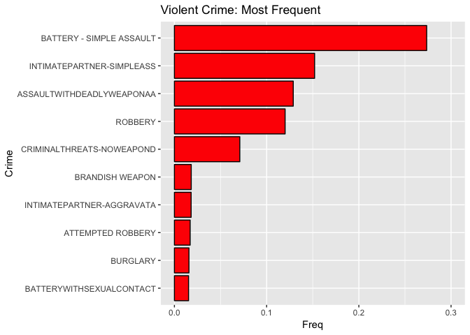

``` r
#Weapons Used
JJ5<- as.data.frame(prop.table(table(z4$Weapon.Description[which(z4$ViolentCrime==1)]))) %>% arrange(desc(Freq)) %>% head(10)
names(JJ5)[1] <- "Weapon"
kable(JJ5)
```

<table>
<thead>
<tr>
<th style="text-align:left;">
Weapon
</th>
<th style="text-align:right;">
Freq
</th>
</tr>
</thead>
<tbody>
<tr>
<td style="text-align:left;">
STRONG-ARM (HANDS, FIST, FEET OR BODILY FORCE)
</td>
<td style="text-align:right;">
0.6084471
</td>
</tr>
<tr>
<td style="text-align:left;">
VERBAL THREAT
</td>
<td style="text-align:right;">
0.0832592
</td>
</tr>
<tr>
<td style="text-align:left;">
UNKNOWN WEAPON/OTHER WEAPON
</td>
<td style="text-align:right;">
0.0787477
</td>
</tr>
<tr>
<td style="text-align:left;">
HAND GUN
</td>
<td style="text-align:right;">
0.0479062
</td>
</tr>
<tr>
<td style="text-align:left;">
SEMI-AUTOMATIC PISTOL
</td>
<td style="text-align:right;">
0.0189389
</td>
</tr>
<tr>
<td style="text-align:left;">
KNIFE WITH BLADE 6INCHES OR LESS
</td>
<td style="text-align:right;">
0.0179421
</td>
</tr>
<tr>
<td style="text-align:left;">
OTHER KNIFE
</td>
<td style="text-align:right;">
0.0132905
</td>
</tr>
<tr>
<td style="text-align:left;">
UNKNOWN FIREARM
</td>
<td style="text-align:right;">
0.0112709
</td>
</tr>
<tr>
<td style="text-align:left;">
VEHICLE
</td>
<td style="text-align:right;">
0.0102170
</td>
</tr>
<tr>
<td style="text-align:left;">
REVOLVER
</td>
<td style="text-align:right;">
0.0085055
</td>
</tr>
</tbody>
</table>
``` r
#Violent Crime: Hour Occurred 
J2 <- as.data.frame(prop.table(table(z4$Hour[which(z4$ViolentCrime==1)])))
J3 <-ggplot(aes(x=Var1,y=Freq), data = J2) +geom_bar(stat="identity",fill="red", colour="black") +ggtitle("Violent Crime: Time Occurred by Hour") +xlab("Hour")+ylim(0,.1)
J3
```

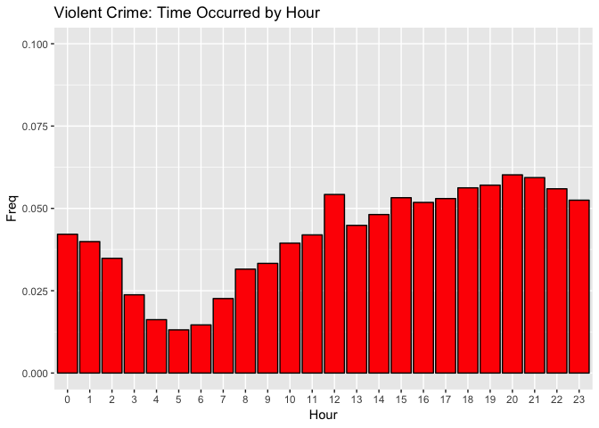

``` r
#3 Violent Crime Victims: Frequency by Age Group
HH1 <-as.data.frame(prop.table(table(z4$VictimAgeGroups[which(z4$ViolentCrime==1)])))
HH2 <-ggplot(aes(x=Var1,y=Freq),data =HH1) + geom_bar(stat="identity",fill="red",colour="black")+xlab("Age Group")+ylab("Frequency") + ggtitle("Violent Crime: Frequency by Victim Age Group")+ylim(0,.3)
HH2
```

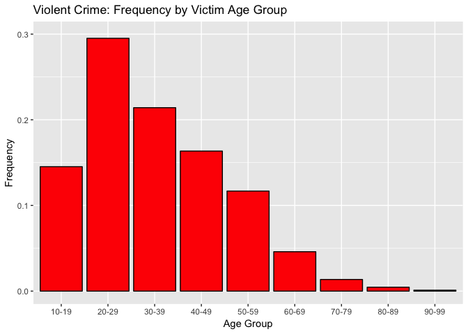

``` r
#4 Violent vs Non: Frequency by Day
h1 <-as.data.frame(prop.table(table(z4$WeekdayOcc[which(z4$ViolentCrime==1)])))
h2 <- as.data.frame(prop.table(table(z4$WeekdayRep[which(z4$ViolentCrime==1)])))
g4 <- cbind(h1,h2)[,-3]
names(g4) <- c("Day", "Occurred", "Reported")
h5 <- gather(g4,Day, Freq:Day)
h5 <-cbind(h5, rep(c("Monday","Tuesday","Wednesday","Thursday","Friday","Saturday","Sunday"),2))
names(h5) <- c("OccRep", "Prop.Freq", "Day")
h5$Day <- factor(h5$Day,levels=c("Monday","Tuesday","Wednesday","Thursday","Friday","Saturday","Sunday"),ordered=T)
H5 <-ggplot(h5,aes(x=as.factor(Day),y=Prop.Freq,fill=factor(OccRep)))+
  geom_bar(stat="identity",position="dodge",colour="black")+
  scale_fill_manual(values= c("#599ad3", "#f9a65a"),name="Day",labels=c("Occurred", "Reported"))+
  xlab("Day")+ylab("Frequency") + ggtitle("Violent Crime: Frequency by Day") + theme(legend.position ="right")+ geom_text(aes(label=signif(Prop.Freq,3)), position=position_dodge(width=0.9), vjust=-0.25)
H5
```

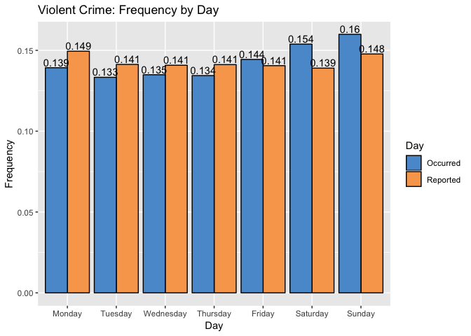

``` r
#5 Days Unreported could be turned into a graph
y11 <- as.data.frame(prop.table(table(z4$DaysUnreported[which(z4$ViolentCrime==1)])) %>% head(20))
names(y11)[1] <- "Days Unreported"
kable(y11)
```

<table>
<thead>
<tr>
<th style="text-align:left;">
Days Unreported
</th>
<th style="text-align:right;">
Freq
</th>
</tr>
</thead>
<tbody>
<tr>
<td style="text-align:left;">
0
</td>
<td style="text-align:right;">
0.6654599
</td>
</tr>
<tr>
<td style="text-align:left;">
1
</td>
<td style="text-align:right;">
0.1914273
</td>
</tr>
<tr>
<td style="text-align:left;">
2
</td>
<td style="text-align:right;">
0.0375818
</td>
</tr>
<tr>
<td style="text-align:left;">
3
</td>
<td style="text-align:right;">
0.0184716
</td>
</tr>
<tr>
<td style="text-align:left;">
4
</td>
<td style="text-align:right;">
0.0108244
</td>
</tr>
<tr>
<td style="text-align:left;">
5
</td>
<td style="text-align:right;">
0.0073755
</td>
</tr>
<tr>
<td style="text-align:left;">
6
</td>
<td style="text-align:right;">
0.0054754
</td>
</tr>
<tr>
<td style="text-align:left;">
7
</td>
<td style="text-align:right;">
0.0046828
</td>
</tr>
<tr>
<td style="text-align:left;">
8
</td>
<td style="text-align:right;">
0.0033641
</td>
</tr>
<tr>
<td style="text-align:left;">
9
</td>
<td style="text-align:right;">
0.0025802
</td>
</tr>
<tr>
<td style="text-align:left;">
10
</td>
<td style="text-align:right;">
0.0024539
</td>
</tr>
<tr>
<td style="text-align:left;">
11
</td>
<td style="text-align:right;">
0.0018967
</td>
</tr>
<tr>
<td style="text-align:left;">
12
</td>
<td style="text-align:right;">
0.0015834
</td>
</tr>
<tr>
<td style="text-align:left;">
13
</td>
<td style="text-align:right;">
0.0014346
</td>
</tr>
<tr>
<td style="text-align:left;">
14
</td>
<td style="text-align:right;">
0.0017565
</td>
</tr>
<tr>
<td style="text-align:left;">
15
</td>
<td style="text-align:right;">
0.0012200
</td>
</tr>
<tr>
<td style="text-align:left;">
16
</td>
<td style="text-align:right;">
0.0011127
</td>
</tr>
<tr>
<td style="text-align:left;">
17
</td>
<td style="text-align:right;">
0.0009812
</td>
</tr>
<tr>
<td style="text-align:left;">
18
</td>
<td style="text-align:right;">
0.0009310
</td>
</tr>
<tr>
<td style="text-align:left;">
19
</td>
<td style="text-align:right;">
0.0008047
</td>
</tr>
</tbody>
</table>
``` r
#6 Common victims of a crime of violent nature
z4violent2 <- transform(z4violent, victim = paste(VictimAgeGroups,SimplifiedDescent,Victim.Sex, sep=", "))
x9 <- as.data.frame(table(z4violent2$victim)) %>% arrange(desc(Freq)) %>% head(10)
names(x9)[1] <- "Demographic"
kable(x9)
```

<table>
<thead>
<tr>
<th style="text-align:left;">
Demographic
</th>
<th style="text-align:right;">
Freq
</th>
</tr>
</thead>
<tbody>
<tr>
<td style="text-align:left;">
20-29, H, F
</td>
<td style="text-align:right;">
46459
</td>
</tr>
<tr>
<td style="text-align:left;">
20-29, H, M
</td>
<td style="text-align:right;">
37075
</td>
</tr>
<tr>
<td style="text-align:left;">
30-39, H, F
</td>
<td style="text-align:right;">
31560
</td>
</tr>
<tr>
<td style="text-align:left;">
20-29, B, F
</td>
<td style="text-align:right;">
29186
</td>
</tr>
<tr>
<td style="text-align:left;">
30-39, H, M
</td>
<td style="text-align:right;">
27228
</td>
</tr>
<tr>
<td style="text-align:left;">
10-19, H, F
</td>
<td style="text-align:right;">
26530
</td>
</tr>
<tr>
<td style="text-align:left;">
10-19, H, M
</td>
<td style="text-align:right;">
21299
</td>
</tr>
<tr>
<td style="text-align:left;">
40-49, H, F
</td>
<td style="text-align:right;">
20626
</td>
</tr>
<tr>
<td style="text-align:left;">
40-49, H, M
</td>
<td style="text-align:right;">
20247
</td>
</tr>
<tr>
<td style="text-align:left;">
30-39, B, F
</td>
<td style="text-align:right;">
18063
</td>
</tr>
</tbody>
</table>
``` r
#7 Mapping of Every Violent Crime Committed in Data by Area ID
LA <- get_map(location= "los angeles map",zoom=10,source="google", maptype="satellite")
LAmap <- ggmap(LA)
LAmap + geom_point(aes(x=Longitude, y=Latitude,color=Area.ID), data=z4violent,size=1) + ggtitle("Mapping of Area ID") + xlab("Latitude") + ylab("Longitude")
```

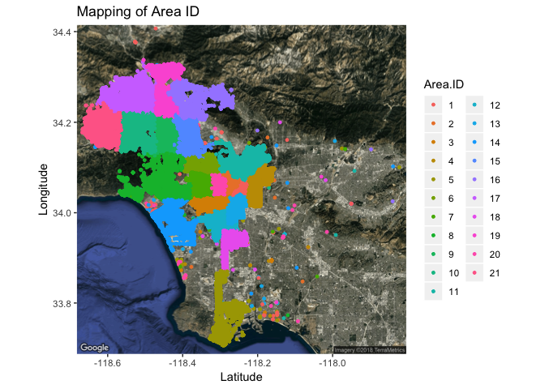

Time Series Analysis
====================

``` r
vcrime <- z4[which(z4$ViolentCrime==1),]
vcrime$monthyear <- (format(ymd(vcrime$Date.Occurred), "%Y-%m"))
vcrimetable <- as.data.frame(table(vcrime$monthyear))
str(vcrimetable)
```

    ## 'data.frame':    101 obs. of  2 variables:
    ##  $ Var1: Factor w/ 101 levels "2010-01","2010-02",..: 1 2 3 4 5 6 7 8 9 10 ...
    ##  $ Freq: int  6236 5319 5984 5908 6217 6315 6177 5887 5751 5952 ...

``` r
vcrimetable$Var1 <- ymd(as.character(vcrimetable$Var1), truncated = 1L)
vcrimetable <- vcrimetable[-101,]
vcrimefreq <- ts(vcrimetable$Freq)

auto.arima(vcrimetable$Freq)
```

    ## Series: vcrimetable$Freq 
    ## ARIMA(2,1,1) 
    ## 
    ## Coefficients:
    ##          ar1     ar2      ma1
    ##       0.3553  0.3070  -0.9143
    ## s.e.  0.1175  0.1102   0.0607
    ## 
    ## sigma^2 estimated as 144835:  log likelihood=-727.46
    ## AIC=1462.92   AICc=1463.35   BIC=1473.3

``` r
vcrimefreq
```

    ## Time Series:
    ## Start = 1 
    ## End = 100 
    ## Frequency = 1 
    ##   [1] 6236 5319 5984 5908 6217 6315 6177 5887 5751 5952 5234 5282 5634 4776
    ##  [15] 5802 5766 5924 5722 5997 5892 5635 5875 5269 5270 5328 4789 5247 5313
    ##  [29] 5936 5650 5509 6064 5790 5668 4852 4824 4939 4354 5278 5182 5512 5358
    ##  [43] 5455 5639 5166 5079 4798 4675 4831 4314 5221 5133 5831 5692 5968 5837
    ##  [57] 5806 5765 5392 5272 5650 4948 6003 5640 5936 5906 6158 6412 6232 6524
    ##  [71] 5420 5552 5841 5837 5976 6238 6259 6353 6606 6380 6255 6593 5803 6079
    ##  [85] 6015 5547 6511 6239 6403 6444 7198 6784 6613 6993 6258 5901 6242 5763
    ##  [99] 6499 6619

``` r
plot.ts(vcrimefreq) #There appears to be trend and seasonality. Variance looks to be constant.
```

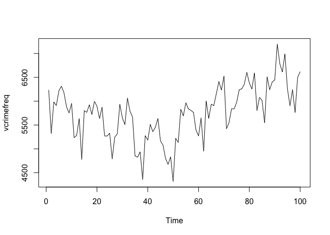

``` r
#So we will remove the trend by taking the difference
par(mfrow=c(3,1))
plot(diff(vcrimefreq)) #d=1
acf(diff(vcrimefreq)) #ACF of the difference model shows strong autocorrelation with lag 12, indicating yearly seasonality.
pacf(diff(vcrimefreq))
```

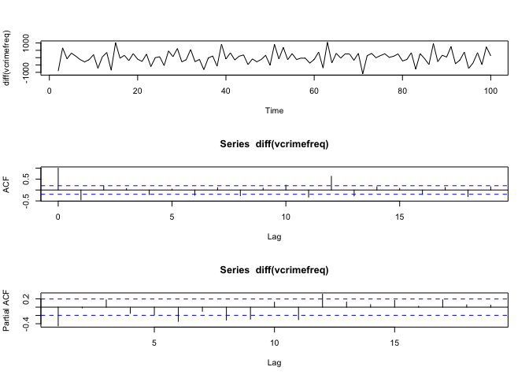

``` r
plot(diff(diff(vcrimefreq), 12)) #now take the seasonal difference

Box.test(diff(diff(vcrimefreq), 12), lag= log(length(vcrimefreq))) #lag = logarithm of length of the ts... why? idk
```

    ## 
    ##  Box-Pierce test
    ## 
    ## data:  diff(diff(vcrimefreq), 12)
    ## X-squared = 23.764, df = 4.6052, p-value = 0.0001654

``` r
#Ljung-box test is very small, therefore we reject the null hypothesis that there is no autocorrelation between previous lags, indicating that there is autocorrelation.

acf(diff(diff(vcrimefreq), 12)) #acf suggests MA(1), and spike at lag 12, indicating SMA(1)
pacf(diff(diff(vcrimefreq), 12)) #pacf suggests AR(3), #2 spikes 12, 11 indicate SAR 0,1, or 2
```

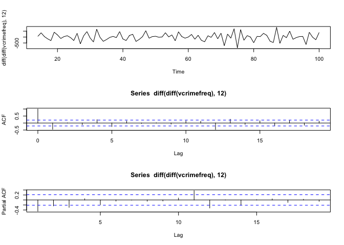

``` r
#Comparing various models
for(p in 0:3){
  for(q in 0:1){
    for(i in 0:1){
      for(j in 0:1){
        if(p+1+q+i+1+j<=6){
          model<-arima(x=vcrimefreq, order = c(p,1,q), seasonal = list(order=c(i,1,j), period=12))
          pval<-Box.test(model$residuals, lag=log(length(model$residuals)))
          sse<-sum(model$residuals^2)
          cat(p,1,q,i,1,j,12, 'AIC=', model$aic, ' SSE=',sse,' p-VALUE=', pval$p.value,'\n')
        }
      }
    }
  }
}
```

    ## 0 1 0 0 1 0 12 AIC= 1255.125  SSE= 9173454  p-VALUE= 3.298981e-05 
    ## 0 1 0 0 1 1 12 AIC= 1224.31  SSE= 5476894  p-VALUE= 0.0003443173 
    ## 0 1 0 1 1 0 12 AIC= 1234.674  SSE= 6830245  p-VALUE= 2.85806e-06 
    ## 0 1 0 1 1 1 12 AIC= 1226.293  SSE= 5511059  p-VALUE= 0.000342276 
    ## 0 1 1 0 1 0 12 AIC= 1225.935  SSE= 6366042  p-VALUE= 0.7628003 
    ## 0 1 1 0 1 1 12 AIC= 1201.659  SSE= 4330082  p-VALUE= 0.6811936 
    ## 0 1 1 1 1 0 12 AIC= 1208.506  SSE= 4932216  p-VALUE= 0.5541652 
    ## 0 1 1 1 1 1 12 AIC= 1203.588  SSE= 4343695  p-VALUE= 0.6950038 
    ## 1 1 0 0 1 0 12 AIC= 1237.551  SSE= 7306368  p-VALUE= 0.01932179 
    ## 1 1 0 0 1 1 12 AIC= 1210.547  SSE= 4757314  p-VALUE= 0.01110135 
    ## 1 1 0 1 1 0 12 AIC= 1215.921  SSE= 5351432  p-VALUE= 0.02860231 
    ## 1 1 0 1 1 1 12 AIC= 1212.316  SSE= 4792351  p-VALUE= 0.01280496 
    ## 1 1 1 0 1 0 12 AIC= 1227.927  SSE= 6365520  p-VALUE= 0.7514252 
    ## 1 1 1 0 1 1 12 AIC= 1203.65  SSE= 4329573  p-VALUE= 0.6830068 
    ## 1 1 1 1 1 0 12 AIC= 1210.446  SSE= 4927071  p-VALUE= 0.6077443 
    ## 1 1 1 1 1 1 12 AIC= 1205.574  SSE= 4343721  p-VALUE= 0.6992976 
    ## 2 1 0 0 1 0 12 AIC= 1234.422  SSE= 6878544  p-VALUE= 0.1068389 
    ## 2 1 0 0 1 1 12 AIC= 1206.229  SSE= 4385157  p-VALUE= 0.1450918 
    ## 2 1 0 1 1 0 12 AIC= 1214.57  SSE= 5159007  p-VALUE= 0.1206095 
    ## 2 1 0 1 1 1 12 AIC= 1208.062  SSE= 4408382  p-VALUE= 0.1602216 
    ## 2 1 1 0 1 0 12 AIC= 1229.897  SSE= 6363088  p-VALUE= 0.7489733 
    ## 2 1 1 0 1 1 12 AIC= 1205.108  SSE= 4277032  p-VALUE= 0.7395769 
    ## 2 1 1 1 1 0 12 AIC= 1212.443  SSE= 4926777  p-VALUE= 0.6102401 
    ## 3 1 0 0 1 0 12 AIC= 1228.172  SSE= 6235340  p-VALUE= 0.9727374 
    ## 3 1 0 0 1 1 12 AIC= 1203.169  SSE= 4186866  p-VALUE= 0.9853113 
    ## 3 1 0 1 1 0 12 AIC= 1209.288  SSE= 4736393  p-VALUE= 0.997779 
    ## 3 1 1 0 1 0 12 AIC= 1229.544  SSE= 6188282  p-VALUE= 0.8212989

``` r
p=0;q=1;P=0;Q=1
ts.model <- arima(x=vcrimefreq, order=c(p,1,q), seasonal = list(order=c(P,1,Q),period=12))
#I end up choosing ARIMA(0,1,1,0,1,1)12 model, as it conforms to the parsimony principle and outputs the smallest AIC of models I tested
#Check p values for model
Box.test(ts.model$residuals, lag = log(length(ts.model$residuals)))
```

    ## 
    ##  Box-Pierce test
    ## 
    ## data:  ts.model$residuals
    ## X-squared = 2.7936, df = 4.6052, p-value = 0.6812

``` r
#Look at residuals to see if there is any remaining autocorrelation
sarima(vcrimefreq,0,1,1,0,1,1,12)
```

    ## initial  value 5.782929 
    ## iter   2 value 5.483115
    ## iter   3 value 5.464712
    ## iter   4 value 5.458987
    ## iter   5 value 5.455982
    ## iter   6 value 5.455749
    ## iter   7 value 5.455744
    ## iter   8 value 5.455742
    ## iter   8 value 5.455742
    ## iter   8 value 5.455742
    ## final  value 5.455742 
    ## converged
    ## initial  value 5.455490 
    ## iter   2 value 5.453286
    ## iter   3 value 5.452669
    ## iter   4 value 5.452665
    ## iter   4 value 5.452665
    ## iter   4 value 5.452665
    ## final  value 5.452665 
    ## converged

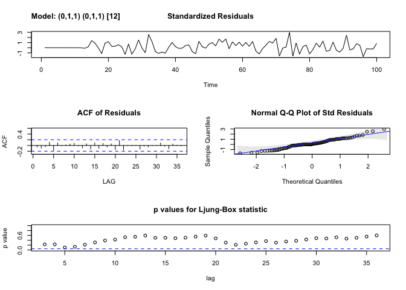

    ## $fit
    ## 
    ## Call:
    ## stats::arima(x = xdata, order = c(p, d, q), seasonal = list(order = c(P, D, 
    ##     Q), period = S), include.mean = !no.constant, optim.control = list(trace = trc, 
    ##     REPORT = 1, reltol = tol))
    ## 
    ## Coefficients:
    ##           ma1     sma1
    ##       -0.5874  -0.6801
    ## s.e.   0.0836   0.1291
    ## 
    ## sigma^2 estimated as 49765:  log likelihood = -597.83,  aic = 1201.66
    ## 
    ## $degrees_of_freedom
    ## [1] 85
    ## 
    ## $ttable
    ##      Estimate     SE t.value p.value
    ## ma1   -0.5874 0.0836 -7.0277       0
    ## sma1  -0.6801 0.1291 -5.2676       0
    ## 
    ## $AIC
    ## [1] 11.85506
    ## 
    ## $AICc
    ## [1] 11.87756
    ## 
    ## $BIC
    ## [1] 10.90717

``` r
#Model: X_t = X_t-1 + X_t-12 - X_t-13 + Z_t - .5874*Z_t-1 - .6801*Z_t-12 + .399*Z_t-13
par(mfrow=c(1,1))
#Note: Monthly Time series Starts January-2010, ends April-2018.

forecast(ts.model)
```

    ##     Point Forecast    Lo 80    Hi 80    Lo 95    Hi 95
    ## 101       6755.159 6469.107 7041.211 6317.680 7192.637
    ## 102       6738.592 6429.146 7048.038 6265.335 7211.849
    ## 103       7109.236 6778.044 7440.428 6602.721 7615.751
    ## 104       6979.305 6627.708 7330.901 6441.585 7517.024
    ## 105       6801.681 6430.803 7172.560 6234.471 7368.892
    ## 106       7042.135 6652.927 7431.343 6446.893 7637.377
    ## 107       6312.096 5905.385 6718.807 5690.085 6934.107
    ## 108       6256.525 5833.033 6680.017 5608.850 6904.200
    ## 109       6473.472 6033.846 6913.098 5801.122 7145.822
    ## 110       6013.265 5558.079 6468.450 5317.118 6709.411
    ## 111       6760.458 6290.228 7230.689 6041.302 7479.614
    ## 112       6730.013 6245.203 7214.822 5988.561 7471.464
    ## 113       6943.275 6415.034 7471.516 6135.400 7751.150
    ## 114       6926.708 6375.954 7477.462 6084.402 7769.014
    ## 115       7297.352 6724.970 7869.735 6421.969 8172.735
    ## 116       7167.421 6574.198 7760.643 6260.165 8074.676
    ## 117       6989.797 6376.442 7603.153 6051.752 7927.843
    ## 118       7230.251 6597.403 7863.099 6262.394 8198.108
    ## 119       6500.212 5848.455 7151.969 5503.435 7496.989
    ## 120       6444.641 5774.507 7114.774 5419.760 7469.522
    ## 121       6661.588 5973.553 7349.623 5609.329 7713.847
    ## 122       6201.381 5495.931 6906.830 5122.489 7280.272
    ## 123       6948.574 6226.131 7671.018 5843.692 8053.457
    ## 124       6918.129 6179.081 7657.176 5787.853 8048.404

``` r
#Forecasts for the next two years
autoplot(forecast(ts.model)) +ggtitle("Monthly Forecasts for May 2018 - May 2020") +ylab("Violent Crime Frequency")  + xlab("Month (x=1=January 2010)")
```

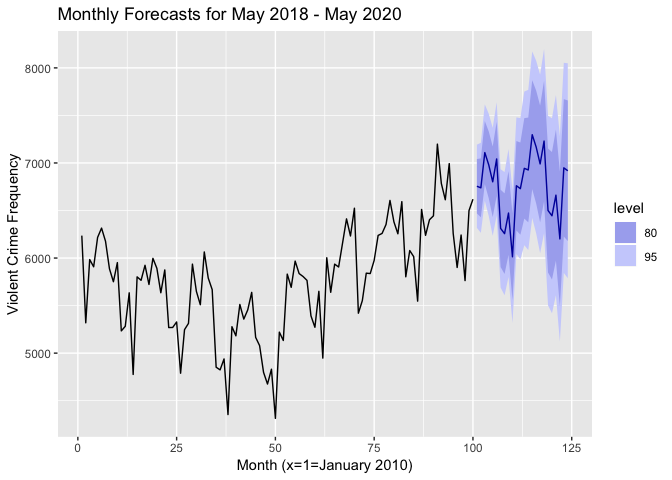

``` r
ts.model
```

    ## 
    ## Call:
    ## arima(x = vcrimefreq, order = c(p, 1, q), seasonal = list(order = c(P, 1, Q), 
    ##     period = 12))
    ## 
    ## Coefficients:
    ##           ma1     sma1
    ##       -0.5874  -0.6801
    ## s.e.   0.0836   0.1291
    ## 
    ## sigma^2 estimated as 49765:  log likelihood = -597.83,  aic = 1201.66

Part Three: Logistic Regression
===============================

``` r
#Splitting data into a training and test dataset
set.seed(100)
sample1 <- sample(nrow(z4), .7*nrow(z4),replace= F)
train <- z4[sample1,]
test <- z4[-sample1,]


interaction.plot(train$SimplifiedDescent, train$Victim.Sex, train$ViolentCrime,trace.label= "Sex", xlab="Victim Descent", ylab = "Violent Crime", col=2:5)
```

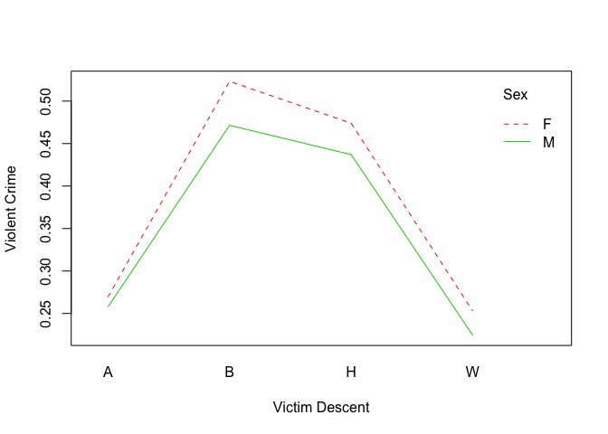

``` r
#In terms of percentage of crimes, if a man or woman of Black/Hispanic descent are victims of a crime, the crime is more likely to be violent compared to Asian or White victims.  Women of all races are victims in violent crimes more often that men. Of the crimes reported where the victim was a black woman, over 50% was a violent crime.

interaction.plot(as.factor(train$Area.ID), train$SimplifiedDescent, train$ViolentCrime,xlab= "Area ID", ylab= "Violent Crime", trace.label= "Victim Descent", xtick=T,col=2:6)
```

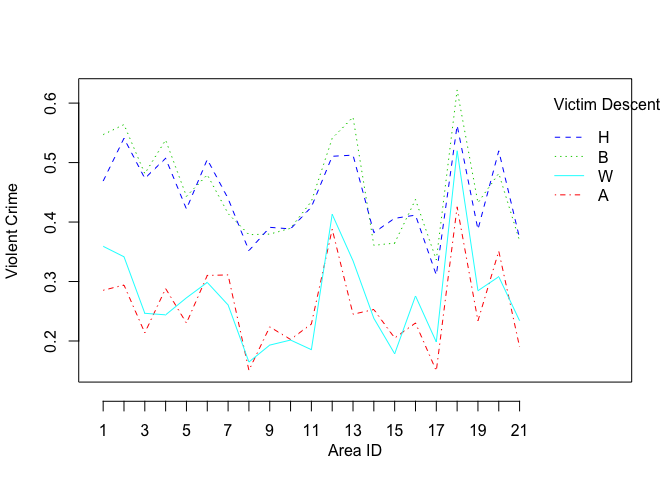

``` r
#Reiterates the observation that black/hispanic people in Los Angeles face violent crimes more often than whites/asians. Lines are parallel which indicates this observation is true for all areas in city of LA. Shows that the percentage of crimes which are violent varies based on the crime's Area ID.
interaction.plot(as.factor(train$Area.ID), train$Victim.Sex, train$ViolentCrime,trace.label= "Sex", xlab="Area ID", ylab = "Violent Crime", col=2:5, xtick=T)
```

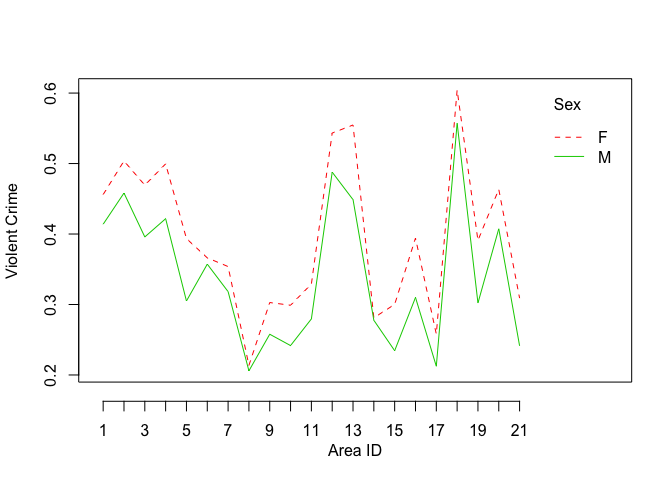

``` r
#All interactions are parallel indicating no interaction effect.

#Making logistic regression model based upon significant variables
m2 <-glm(ViolentCrime ~ Victim.Age + DaysUnreported + SimplifiedDescent + Status.Description + Area.ID, family = "binomial", data=train)
summary(m2)
```

    ## 
    ## Call:
    ## glm(formula = ViolentCrime ~ Victim.Age + DaysUnreported + SimplifiedDescent + 
    ##     Status.Description + Area.ID, family = "binomial", data = train)
    ## 
    ## Deviance Residuals: 
    ##     Min       1Q   Median       3Q      Max  
    ## -2.2410  -0.8717  -0.5681   1.0186   3.4573  
    ## 
    ## Coefficients:
    ##                                 Estimate Std. Error  z value Pr(>|z|)    
    ## (Intercept)                    1.419e+00  1.923e-02   73.824  < 2e-16 ***
    ## Victim.Age                    -1.935e-02  1.630e-04 -118.695  < 2e-16 ***
    ## DaysUnreported                -1.642e-03  3.435e-05  -47.814  < 2e-16 ***
    ## SimplifiedDescentB             7.498e-01  1.431e-02   52.405  < 2e-16 ***
    ## SimplifiedDescentH             6.135e-01  1.365e-02   44.933  < 2e-16 ***
    ## SimplifiedDescentW             3.552e-02  1.406e-02    2.526  0.01154 *  
    ## Status.DescriptionAdult Other  2.026e-01  9.855e-03   20.557  < 2e-16 ***
    ## Status.DescriptionInvest Cont -1.601e+00  7.845e-03 -204.067  < 2e-16 ***
    ## Status.DescriptionJuv Arrest  -1.556e-02  2.810e-02   -0.554  0.57971    
    ## Status.DescriptionJuv Other    7.667e-02  4.580e-02    1.674  0.09413 .  
    ## Area.ID2                      -1.405e-01  1.535e-02   -9.154  < 2e-16 ***
    ## Area.ID3                      -3.533e-01  1.373e-02  -25.743  < 2e-16 ***
    ## Area.ID4                      -1.608e-01  1.647e-02   -9.767  < 2e-16 ***
    ## Area.ID5                      -6.093e-01  1.582e-02  -38.517  < 2e-16 ***
    ## Area.ID6                      -2.740e-01  1.549e-02  -17.681  < 2e-16 ***
    ## Area.ID7                      -4.355e-01  1.590e-02  -27.395  < 2e-16 ***
    ## Area.ID8                      -9.390e-01  1.765e-02  -53.190  < 2e-16 ***
    ## Area.ID9                      -9.412e-01  1.608e-02  -58.546  < 2e-16 ***
    ## Area.ID10                     -8.821e-01  1.702e-02  -51.818  < 2e-16 ***
    ## Area.ID11                     -6.593e-01  1.569e-02  -42.015  < 2e-16 ***
    ## Area.ID12                      3.476e-02  1.341e-02    2.592  0.00954 ** 
    ## Area.ID13                      7.378e-02  1.490e-02    4.952 7.35e-07 ***
    ## Area.ID14                     -5.250e-01  1.544e-02  -33.994  < 2e-16 ***
    ## Area.ID15                     -9.757e-01  1.537e-02  -63.467  < 2e-16 ***
    ## Area.ID16                     -5.736e-01  1.641e-02  -34.951  < 2e-16 ***
    ## Area.ID17                     -9.752e-01  1.668e-02  -58.451  < 2e-16 ***
    ## Area.ID18                      2.514e-01  1.431e-02   17.568  < 2e-16 ***
    ## Area.ID19                     -6.089e-01  1.517e-02  -40.147  < 2e-16 ***
    ## Area.ID20                     -1.747e-01  1.572e-02  -11.110  < 2e-16 ***
    ## Area.ID21                     -7.446e-01  1.612e-02  -46.195  < 2e-16 ***
    ## ---
    ## Signif. codes:  0 '***' 0.001 '**' 0.01 '*' 0.05 '.' 0.1 ' ' 1
    ## 
    ## (Dispersion parameter for binomial family taken to be 1)
    ## 
    ##     Null deviance: 1216371  on 908401  degrees of freedom
    ## Residual deviance: 1026930  on 908372  degrees of freedom
    ##   (310491 observations deleted due to missingness)
    ## AIC: 1026990
    ## 
    ## Number of Fisher Scoring iterations: 4

``` r
#Victim Age is a significant predictor in whether a crime is violent, with the older the victim's age is, the less likely the crime will be of violent nature.
exp(m2$coefficients)
```

    ##                   (Intercept)                    Victim.Age 
    ##                     4.1346626                     0.9808339 
    ##                DaysUnreported            SimplifiedDescentB 
    ##                     0.9983591                     2.1166801 
    ##            SimplifiedDescentH            SimplifiedDescentW 
    ##                     1.8468970                     1.0361555 
    ## Status.DescriptionAdult Other Status.DescriptionInvest Cont 
    ##                     1.2245651                     0.2017343 
    ##  Status.DescriptionJuv Arrest   Status.DescriptionJuv Other 
    ##                     0.9845561                     1.0796822 
    ##                      Area.ID2                      Area.ID3 
    ##                     0.8688938                     0.7023364 
    ##                      Area.ID4                      Area.ID5 
    ##                     0.8514403                     0.5437460 
    ##                      Area.ID6                      Area.ID7 
    ##                     0.7603657                     0.6469123 
    ##                      Area.ID8                      Area.ID9 
    ##                     0.3910155                     0.3901684 
    ##                     Area.ID10                     Area.ID11 
    ##                     0.4139133                     0.5172345 
    ##                     Area.ID12                     Area.ID13 
    ##                     1.0353670                     1.0765650 
    ##                     Area.ID14                     Area.ID15 
    ##                     0.5915682                     0.3769131 
    ##                     Area.ID16                     Area.ID17 
    ##                     0.5635124                     0.3771269 
    ##                     Area.ID18                     Area.ID19 
    ##                     1.2858865                     0.5439708 
    ##                     Area.ID20                     Area.ID21 
    ##                     0.8397197                     0.4749014

``` r
#Making predictions
predictionsCrime <- predict(m2, test, type="response")
predictionsCrime[predictionsCrime > .5] <- 1
predictionsCrime[predictionsCrime <= .5] <- 0
predictions1 <- (data.frame(predictionsCrime, test$ViolentCrime))
predictions1 <- predictions1[-which(is.na(predictions1[,1])),]
table(predictions1)
```

    ##                 test.ViolentCrime
    ## predictionsCrime      0      1
    ##                0 202451  77136
    ##                1  33977  75273

``` r
(202451+75273)/(202451+75273+77136+33977)
```

    ## [1] 0.7142427

``` r
#Result: Predicted correct outcome 71.4% of the time.
```
